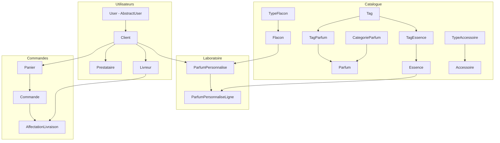

# 🔍 Analyse complète — Accessoire Exclusif

## 📋 Ce que tu développes

**Accessoire Exclusif** est une **plateforme e-commerce de parfumerie** basée au Cameroun (prix en FCFA, paiement Cash/Mobile Money). Elle comporte **4 modules métier** :

| App | Rôle | Modèles |
|-----|------|---------|
| `utilisateur` | Gestion des utilisateurs | `User`, `Client`, `Prestataire`, `Livreur` |
| `catalogue` | Produits & Tags | `Tag`, `TagParfum`, `TagEssence`, `CategorieParfum`, `Parfum`, `Essence`, `TypeAccessoire`, `Accessoire`, `TypeFlacon`, `Flacon` |
| `laboratoire` | Création parfum DIY | `ParfumPersonnalise`, `ParfumPersonnaliseLigne` |
| `orders` | Panier, Commande, Livraison | `Panier`, `PanierLigne*` (×3), `Commande`, `CommandeLigne*` (×3), `AffectationLivraison`, ~~`MouvementStock`~~ (commenté) |

**L'API REST** (`api/v1/`) est structurée en 4 groupes d'endpoints (`auth`, `shop`, `lab`, `orders`) mais **les serializers et views sont vides** — tout reste à implémenter côté API.

---

## 🏗️ Architecture actuelle



**Points positifs de ton architecture :**
- ✅ Hiérarchie `User → Client → Prestataire/Livreur` bien pensée (pas de duplication téléphone/email)
- ✅ Système de Tags centralisé — très bien pour l'IA et le filtrage
- ✅ Snapshots de prix dans les commandes (les prix ne changent pas rétroactivement)
- ✅ Séparation claire des apps par domaine métier
- ✅ API versionnée (`v1/`)

---

## 🐛 Bugs et incohérences détectés

> [!CAUTION]
> Ces problèmes empêcheront le projet de démarrer (`makemigrations` / `migrate` vont échouer).

### 1. Imports cassés dans `orders/models.py` (ligne 5)
```python
from users.models import Client, Prestataire, Livreur, User  # ❌ 'users' n'existe pas
```
L'app s'appelle `utilisateur`, pas `users`.

### 2. Imports cassés dans `laboratoire/models.py` (ligne 6)
```python
from users.models import Client, User  # ❌ Même problème
```

### 3. `AUTH_USER_MODEL` dans `settings.py` (ligne 141)
```python
AUTH_USER_MODEL = 'users.User'  # ❌ Devrait être 'utilisateur.User'
```

### 4. `INSTALLED_APPS` dupliquées dans `settings.py` (lignes 44-63)
`rest_framework`, `rest_framework.authtoken`, `rest_framework_simplejwt`, `corsheaders`, `allauth`, `allauth.account`, `allauth.socialaccount`, et `dj_rest_auth` sont **déclarés deux fois**.

### 5. `COMMISSION_STATUT_CHOICES` et `STATUT_PAIEMENT_CHOICES` manquants dans `Commande`
Le modèle `Commande` utilise `COMMISSION_STATUT_CHOICES` (ligne 144) et `STATUT_PAIEMENT_CHOICES` (ligne 151) mais ces constantes ont été supprimées du modèle.

### 6. `admin.py` de `orders` importe `MouvementStock` (ligne 8)
```python
from .models import (..., MouvementStock)  # ❌ Ce modèle est commenté
```
Et l'`admin.register(MouvementStock)` en ligne 230 plantera aussi.

### 7. `admin.py` de `catalogue` référence des champs supprimés
- `ParfumAdmin` fieldset "Notes olfactives" inclut `famille_olfactive` (ligne 48) — c'est maintenant une `@property`, pas un champ de BDD.
- `EssenceAdmin` utilise `famille_olfactive` dans `list_display` et `list_filter` (lignes 78-79) — même problème.
- `EssenceAdmin` fieldset "Compatibilités IA" référence `humeurs_compatibles`, `signes_astrologiques_compatibles`, etc. (lignes 94-95) — ce sont maintenant des `@property`.

### 8. `admin.py` de `utilisateur` référence des champs supprimés
- `ClientAdmin` : `telephone`, `newsletter`, `prestataire` (lignes 25-38) — ces champs n'existent plus dans le modèle `Client`.
- `PrestataireAdmin` : `nom`, `prenom`, `telephone`, `adresse`, `commission_type`, `commission_valeur`, `iban` — supprimés.
- `LivreurAdmin` : `telephone`, `telephone_urgence`, `email`, `numero_permis`, `type_vehicule`, `immatriculation`, `zone_livraison` — supprimés.

### 9. `admin.py` de `laboratoire` référence des champs supprimés
- `ParfumPersonnaliseAdmin` : `date_validation`, `valide_par` (lignes 19, 35) — commenté/supprimé du modèle.
- `ParfumPersonnaliseLigneAdmin` et inline : `prix_par_10ml_snapshot` — renommé en `prix_par_ml_snapshot`.
- `list_filter` utilise `essence__famille_olfactive` (ligne 86) — c'est maintenant une `@property`.

### 10. `admin.py` de `orders` référence des champs supprimés de `Commande`
- `CommandeAdmin` fieldsets : `taxe_montant`, `livraison_rue`, `livraison_ville`, `livraison_code_postal`, `livraison_pays`, `numero_suivi`, `transporteur`, `date_expedition`, `reference_paiement` — tous supprimés.
- `AffectationLivraisonAdmin` : `tentatives`, `date_acceptation`, `date_depart`, `adresse_enlevement`, `adresse_livraison_snapshot`, `distance_km` — supprimés.
- `PanierAdmin` : `session_key` dans `list_display` (ligne 41) et fieldsets (ligne 49) — supprimé.

### 11. `Panier.__str__` référence `self.session_key` (ligne 41 de orders/models.py)
Ce champ a été supprimé.

### 12. `PanierLigneParfumPerso` référence `'catalogue.ParfumPersonnalise'` (ligne 75)
Ce modèle est dans l'app `laboratoire`, pas `catalogue`.

---

## 💡 Mes recommandations

### 🔴 Priorité 1 — Corrections urgentes (le projet ne démarre pas sans ça)

1. **Corriger les imports** : `users` → `utilisateur` dans `orders/models.py` et `laboratoire/models.py`
2. **Corriger `AUTH_USER_MODEL`** : `'users.User'` → `'utilisateur.User'`
3. **Dédupliquer `INSTALLED_APPS`**
4. **Remettre `COMMISSION_STATUT_CHOICES` et `STATUT_PAIEMENT_CHOICES`** dans `Commande` ou les supprimer des champs aussi
5. **Mettre à jour tous les `admin.py`** pour refléter les modèles actuels
6. **Corriger la FK `PanierLigneParfumPerso`** : `'catalogue.ParfumPersonnalise'` → `'laboratoire.ParfumPersonnalise'`

### 🟡 Priorité 2 — Améliorations des modèles

7. **Ajouter un champ `adresse` ou `quartier` sur `Client` ou `Commande`** — Au Cameroun la livraison se fait souvent par quartier, pas par adresse postale complète. Un champ `quartier` + `ville` serait plus adapté que le `livraison_rue`/`livraison_code_postal` que tu as supprimé.

8. **Ajouter une `CategorieEssence`** — Comme tu as `CategorieParfum` et `TypeAccessoire`, les essences pourraient aussi bénéficier d'une catégorisation (ex: "Bases florales", "Notes boisées", etc.).

9. **Ajouter un type de tag `tranche_age`** — Tu as un placeholder `tranches_age_compatibles` qui retourne `[]`. Autant l'ajouter dans `TYPE_CHOICES` du modèle `Tag`.

10. **`stock_litre` vs `stock_ml`** — L'essence se stocke en litres (`stock_litre`) mais le prix est en `prix_par_10ml`. C'est cohérent mais pense bien à convertir (1 litre = 1000 ml = 100 × 10ml). Ajoute un `@property stock_ml` pour éviter les erreurs de conversion dans le code métier.

### 🟢 Priorité 3 — API & Frontend

11. **Implémenter les serializers/views API** — C'est la prochaine grosse étape. Je recommande cet ordre :
    - `auth/` : Inscription (`POST`), Login (`POST`), Profil (`GET/PUT`)
    - `shop/` : Liste parfums (`GET`), Détail parfum (`GET`), Liste essences (`GET`), Filtrage par tags (`GET`)
    - `lab/` : Créer parfum perso (`POST`), Ajouter essence (`POST`), Calculer prix (`GET`)
    - `orders/` : Panier (`CRUD`), Passer commande (`POST`), Historique commandes (`GET`)

12. **Ajouter `django-filter`** — Pour le filtrage des parfums/essences par tags, genre, prix, etc. dans l'API REST.

13. **Penser au frontend** — Application mobile (React Native / Flutter) ou site web (React / Next.js) ? Cela influencera la structure de l'API (pagination, format des images, etc.).

### 🔵 Priorité 4 — Sécurité & Production

14. **Ne jamais avoir la `SECRET_KEY` en dur dans `settings.py`** — Utilise `os.environ.get('SECRET_KEY')` ou `python-decouple`.

15. **Configurer CORS** — `corsheaders` est installé mais pas configuré (pas dans `MIDDLEWARE` ni `CORS_ALLOWED_ORIGINS`).

16. **Base de données** — SQLite est OK pour le développement. Pour la production, passe à PostgreSQL.

---

## ❓ Questions pour toi

1. **Est-ce que tu veux que je corrige les bugs d'abord ?** (imports, admin.py, settings.py) — C'est nécessaire avant de faire `makemigrations`.

2. **Tu prévois une app mobile, un site web, ou les deux ?** — Ça oriente le développement de l'API.

3. **Le `MouvementStock` commenté** — Tu veux le supprimer définitivement ou le garder pour plus tard ? C'est utile pour tracer les entrées/sorties de stock.

4. **Pour les adresses de livraison**, tu veux gérer ça comment ? Un champ `quartier` + `ville` suffit ou tu veux un système plus structuré ?
